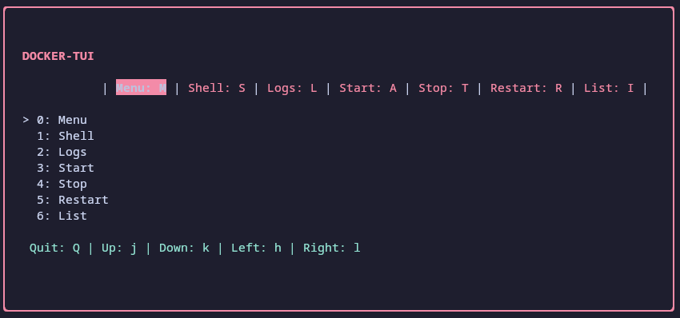
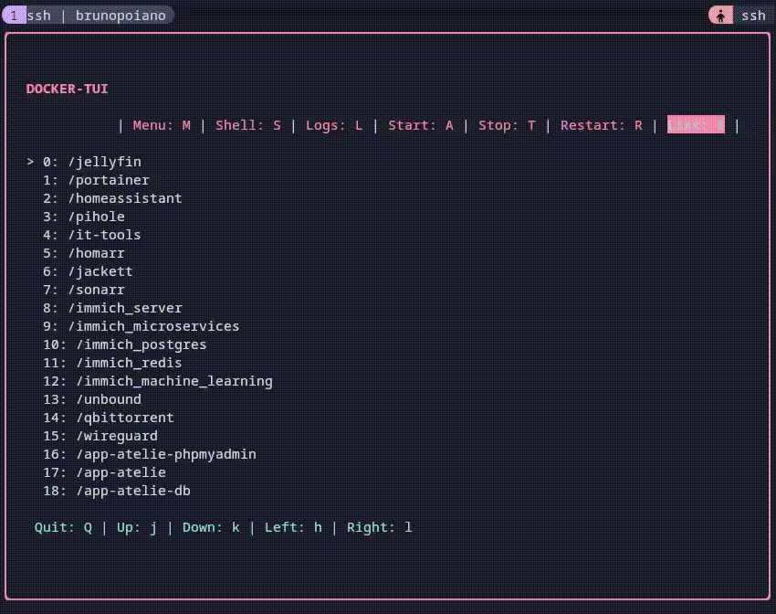
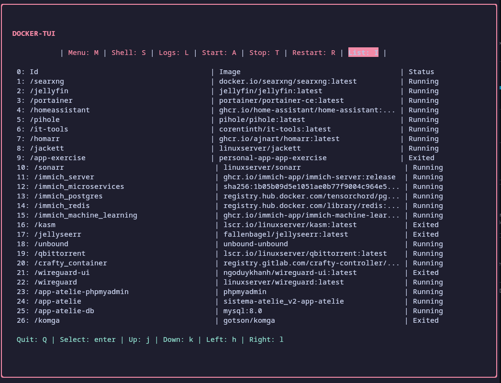
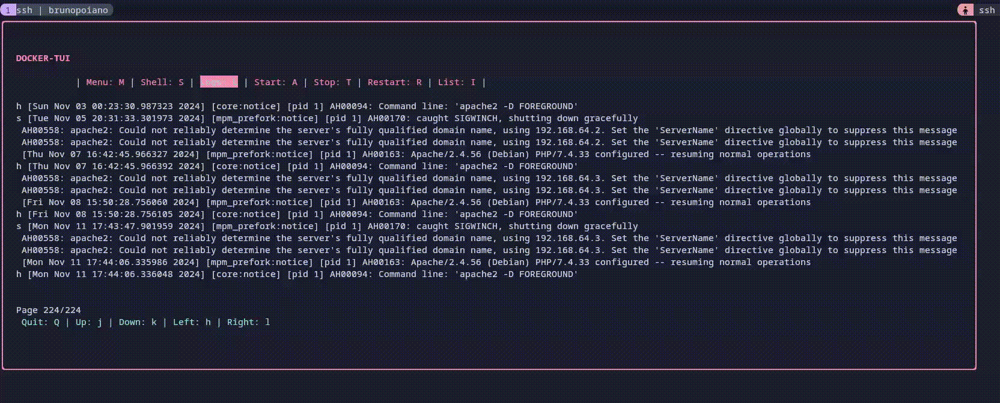

# Docker-TUI

Docker-tui is a simple terminal user interface to interact with docker. Writen in [Go](https://golang.org/) and [Bubbletea](https://github.com/charmbracelet/bubbletea) 🐳



## Deploy

Clone the project

```bash
  git clone https://github.com/BrunoPoiano/docker-tui-go.git
```

cd to the directory

```bash
  cd docker-tui-go
```
Iniciate a new go module

```bash
  go mod init docker-tui
```

```bash
  go mod tidy
```

Compile packages and dependencies

```bash
  go build .
```

Start the project

```bash
  go run .
```

## Docker Actions

Easiest way to start, stop and restart containers 



## Containers List

View the paginated logs 


## Container Logs

View the paginated logs 


## FAQ

#### Shell into containers

Shell functionality is there, it works, but it's still kinda broken. 
